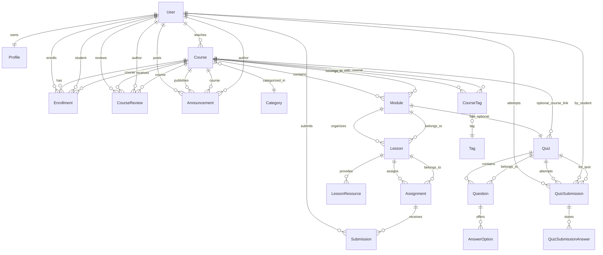

# Domain Model Design

## 1. Overview
The goal is to support a full-featured learning management platform with courses, structured content, assessments and collaboration between teachers and students. The model prioritises:

- **Rich relationships** (1:1, 1:n, n:m) with lazy loading to surface real-world ORM challenges.
- **Extensibility** for additional features (notifications, analytics) without breaking the core.
- **Auditability** and lifecycle metadata for compliance and future reporting.
- **Testability** through clean entity boundaries and predictable cascading rules.

The model uses ~20 JPA entities (excluding base classes / enums) grouped by responsibility: identity, catalogue, learning flow, assessments, feedback and collaboration.

## 2. Entity Inventory
| Entity | Responsibility | Notes |
| --- | --- | --- |
| `User` | Core account for students, teachers, admins | Owns credentials/roles, links to profile, enrolments, submissions, reviews |
| `Profile` | Supplemental user details | 1:1 with `User`, lazy loaded |
| `UserRole` (enum) | Role classification | Values: `STUDENT`, `TEACHER`, `ADMIN` |
| `Course` | Course container | Owned by teacher, linked to category, modules, tags |
| `Category` | Course classification | Maintains list of courses |
| `Tag` | Keyword tagging | Many-to-many with courses via join table |
| `CourseTag` | Join entity for `Course` ↔ `Tag` | Stores tagging metadata (createdBy/date) |
| `Enrollment` | Student registration | Joins `User` (student) and `Course` with status, progress |
| `Module` | Cohesive unit inside course | Orders lessons/quizzes |
| `Lesson` | Instructional content | Holds assignments and lesson resources |
| `LessonResource` | Supplemental material (PDF/video/link) | Supports multiple resource types |
| `Assignment` | Task requiring submission | Linked to lesson, defines deadlines and grading |
| `Submission` | Student response to assignment | Tracks status, score, feedback |
| `Quiz` | Assessment per module/course | Aggregates questions, points, time limit |
| `Question` | Quiz question | Supports multiple types with options |
| `AnswerOption` | Choice for question | Flags correct answers |
| `QuizSubmission` | Quiz attempt result | Linked to student, quiz, score |
| `QuizSubmissionAnswer` | Selected answers during a quiz | Supports multiple choice |
| `CourseReview` | Post-course feedback | Student rating/comment on course |
| `Announcement` | Course-wide message | Optional communication channel |

Supporting abstractions:
- `BaseEntity` (abstract) with `id`, `createdAt`, `updatedAt` (via `@MappedSuperclass`).
- `SoftDeletableEntity` (optional) with `deletedAt` if needed later.
- Enumerations for statuses: `EnrollmentStatus`, `AssignmentStatus`, `SubmissionStatus`, `QuizSubmissionStatus`, `ResourceType`, `QuestionType`.

## 3. Shared Conventions
- **Identifiers**: `Long` primary keys, generated via `@GeneratedValue(strategy = IDENTITY)` to align with PostgreSQL sequences.
- **Audit timestamps**: `OffsetDateTime` columns with UTC default. Managed via `AuditingEntityListener` (to be configured in Phase 3).
- **Lazy loading**: All `@ManyToOne` and `@OneToOne` explicitly set to `FetchType.LAZY` (Hibernate proxy) to encourage handling `LazyInitializationException` in service layer. Collections remain `LAZY` by default.
- **Cascading**: Use targeted cascades (e.g. `CascadeType.ALL` from `Course` to `Module`, but not to `Enrollment`). Avoid cascading from child to parent.
- **Indexes**: Add unique and composite indexes for natural keys (e.g. `user.email`, `enrollment (course_id, student_id)`). Documented per entity below; actual creation via Flyway migrations.

## 4. Entity Details
### 4.1 Identity & Profiles
#### `User`
- Fields: `email` (unique), `passwordHash`, `fullName`, `role` (`UserRole`), `status` (`ACTIVE`, `SUSPENDED`), `timezone`, `lastLoginAt`.
- Relationships:
  - `@OneToOne(mappedBy = "user", cascade = CascadeType.ALL, orphanRemoval = true, fetch = LAZY)` → `Profile` (optional).
  - `@OneToMany(mappedBy = "student", fetch = LAZY)` → `Enrollment`, `Submission`, `QuizSubmission`, `CourseReview`.
  - `@OneToMany(mappedBy = "teacher", fetch = LAZY)` → `Course`.
- Indexes: `email` unique, `(role)` for filtering.

#### `Profile`
- Fields: `bio`, `avatarUrl`, `headline`, `socialLinks` (JSONB), `preferences` (JSONB).
- Relationship: `@OneToOne` with `User` (owning side with FK `user_id`).

### 4.2 Course Catalogue
#### `Category`
- Fields: `name` (unique), `slug`, `description`, `icon`.
- Relationships: `@OneToMany(mappedBy = "category", fetch = LAZY)` → `Course`.

#### `Course`
- Fields: `title`, `slug` (unique per teacher), `summary`, `description`, `difficultyLevel`, `estimatedDuration`, `language`, `publishedAt`, `status` (`DRAFT`, `PUBLISHED`, `ARCHIVED`).
- Relationships:
  - `@ManyToOne(fetch = LAZY)` → `Category`.
  - `@ManyToOne(fetch = LAZY)` → `User` (teacher).
  - `@OneToMany(mappedBy = "course", cascade = CascadeType.ALL, orphanRemoval = true)` → `Module` (ordered).
  - `@OneToMany(mappedBy = "course", cascade = CascadeType.ALL, orphanRemoval = true)` → `Enrollment` (no cascade on persist; use `cascade = PERSIST` only if migrating initial data).
  - `@OneToMany(mappedBy = "course", cascade = CascadeType.ALL, orphanRemoval = true)` → `CourseReview`.
  - `@OneToMany(mappedBy = "course", cascade = CascadeType.ALL, orphanRemoval = true)` → `Announcement`.
  - `@OneToMany(mappedBy = "course", cascade = CascadeType.ALL, orphanRemoval = true)` → `CourseTag` (acts as join entity to `Tag`).
- Indexes: `(teacher_id, status)`, `slug` unique (maybe composite on teacher).

#### `Tag`
- Fields: `name` (unique), `slug`, `description`.
- Relationship: `@OneToMany(mappedBy = "tag", cascade = CascadeType.ALL, orphanRemoval = true)` → `CourseTag`.

#### `CourseTag`
- Fields: `createdAt`, `createdBy` (FK to `User`), `weight` (optional ordering).
- Relationships:
  - `@ManyToOne(fetch = LAZY)` → `Course`.
  - `@ManyToOne(fetch = LAZY)` → `Tag`.
- Unique constraint: `(course_id, tag_id)`.

#### `Announcement`
- Fields: `title`, `content`, `publishedAt`, `visibleUntil`.
- Relationships: `@ManyToOne(fetch = LAZY)` → `Course`, `@ManyToOne(fetch = LAZY)` → `User` (author).

### 4.3 Learning Structure
#### `Module`
- Fields: `title`, `description`, `orderIndex`, `unlockDate`, `isMandatory`.
- Relationships:
  - `@ManyToOne(fetch = LAZY)` → `Course` (owning side).
  - `@OneToMany(mappedBy = "module", cascade = CascadeType.ALL, orphanRemoval = true)` → `Lesson`.
  - `@OneToOne(mappedBy = "module", cascade = CascadeType.ALL, orphanRemoval = true, fetch = LAZY)` → `Quiz` (optional final quiz).
- Index: `(course_id, orderIndex)`.

#### `Lesson`
- Fields: `title`, `summary`, `content` (CLOB/Markdown), `videoUrl`, `durationMinutes`, `orderIndex`.
- Relationships:
  - `@ManyToOne(fetch = LAZY)` → `Module`.
  - `@OneToMany(mappedBy = "lesson", cascade = CascadeType.ALL, orphanRemoval = true)` → `LessonResource`.
  - `@OneToMany(mappedBy = "lesson", cascade = CascadeType.ALL, orphanRemoval = true)` → `Assignment`.
- Index: `(module_id, orderIndex)`.

#### `LessonResource`
- Fields: `title`, `resourceType` (`VIDEO`, `PDF`, `LINK`, `FILE`), `url`, `filePath`, `orderIndex`.
- Relationship: `@ManyToOne(fetch = LAZY)` → `Lesson`.

### 4.4 Enrolment & Progress
#### `Enrollment`
- Fields: `enrolledAt`, `status` (`ACTIVE`, `COMPLETED`, `DROPPED`), `progressPercentage`, `lastAccessAt`.
- Relationships:
  - `@ManyToOne(fetch = LAZY)` → `User` (student).
  - `@ManyToOne(fetch = LAZY)` → `Course`.
  - `@OneToMany(mappedBy = "enrollment", cascade = CascadeType.ALL, orphanRemoval = true)` → `QuizSubmission` (optional link for aggregated results per enrollment).
- Unique constraint: `(course_id, student_id)`.

### 4.5 Assignments & Submissions
#### `Assignment`
- Fields: `title`, `description`, `dueAt`, `maxScore`, `submissionType` (`TEXT`, `UPLOAD`, `EXTERNAL_LINK`), `gradingType` (`NUMERIC`, `PASS_FAIL`), `orderIndex`, `releaseAt`.
- Relationships:
  - `@ManyToOne(fetch = LAZY)` → `Lesson`.
  - `@OneToMany(mappedBy = "assignment", cascade = CascadeType.ALL, orphanRemoval = true)` → `Submission`.
  - `@ManyToOne(fetch = LAZY)` → `User` (creator) for audit.
- Index: `(lesson_id, orderIndex)`.

#### `Submission`
- Fields: `submittedAt`, `content` (text), `attachmentPath`, `status` (`SUBMITTED`, `GRADED`, `RESUBMISSION_REQUIRED`), `score`, `feedback`, `gradedAt`, `graderId` (`User`).
- Relationships:
  - `@ManyToOne(fetch = LAZY)` → `Assignment`.
  - `@ManyToOne(fetch = LAZY)` → `User` (student).
  - Optional `@ManyToOne(fetch = LAZY)` → `User` (grader).
- Unique constraint: `(assignment_id, student_id)` (one active submission per assignment).

### 4.6 Quizzes & Assessments
#### `Quiz`
- Fields: `title`, `description`, `totalPoints`, `timeLimitSeconds`, `attemptLimit`, `gradingMethod` (`HIGHEST`, `LATEST`, `AVERAGE`), `type` (`MODULE_FINAL`, `COURSE_FINAL`).
- Relationships:
  - `@OneToOne(fetch = LAZY)` → `Module` (optional, owning side with FK `module_id`).
  - `@ManyToOne(fetch = LAZY)` → `Course` (if quiz attached to course finals).
  - `@OneToMany(mappedBy = "quiz", cascade = CascadeType.ALL, orphanRemoval = true)` → `Question`.
  - `@OneToMany(mappedBy = "quiz", cascade = CascadeType.ALL, orphanRemoval = true)` → `QuizSubmission`.

#### `Question`
- Fields: `text`, `explanation`, `points`, `questionType` (`SINGLE_CHOICE`, `MULTIPLE_CHOICE`, `TRUE_FALSE`, `OPEN_ENDED`), `orderIndex`.
- Relationships:
  - `@ManyToOne(fetch = LAZY)` → `Quiz`.
  - `@OneToMany(mappedBy = "question", cascade = CascadeType.ALL, orphanRemoval = true)` → `AnswerOption`.

#### `AnswerOption`
- Fields: `text`, `isCorrect`, `feedback`, `orderIndex`.
- Relationship: `@ManyToOne(fetch = LAZY)` → `Question`.

#### `QuizSubmission`
- Fields: `startedAt`, `completedAt`, `score`, `status` (`IN_PROGRESS`, `SUBMITTED`, `GRADED`), `attemptNumber`.
- Relationships:
  - `@ManyToOne(fetch = LAZY)` → `Quiz`.
  - `@ManyToOne(fetch = LAZY)` → `User` (student).
  - `@ManyToOne(fetch = LAZY)` → `Enrollment` (optional convenience link).
  - `@OneToMany(mappedBy = "quizSubmission", cascade = CascadeType.ALL, orphanRemoval = true)` → `QuizSubmissionAnswer`.

#### `QuizSubmissionAnswer`
- Fields: `answerText` (for open-ended), `isCorrect`, `awardedPoints`.
- Relationships:
  - `@ManyToOne(fetch = LAZY)` → `QuizSubmission`.
  - `@ManyToOne(fetch = LAZY)` → `Question`.
  - `@ManyToOne(fetch = LAZY)` → `AnswerOption` (nullable for open-ended).
- Unique constraint: `(quiz_submission_id, question_id, answer_option_id)` to prevent duplicates.

### 4.7 Feedback & Interaction
#### `CourseReview`
- Fields: `rating` (1-5), `comment`, `createdAt`, `updatedAt`, `isPublic`.
- Relationships: `@ManyToOne(fetch = LAZY)` → `Course`, `@ManyToOne(fetch = LAZY)` → `User` (student), optional `@ManyToOne(fetch = LAZY)` → `Enrollment` to ensure review only after participation.
- Unique constraint: `(course_id, student_id)` (one review per student per course).

#### `Announcement`
- Already described in 4.2; acts as feedback/communication entity.

### 4.8 Enumerations & Value Types
- `UserRole`: `STUDENT`, `TEACHER`, `ADMIN`.
- `EnrollmentStatus`: `PENDING`, `ACTIVE`, `COMPLETED`, `WITHDRAWN`.
- `AssignmentStatus`: `DRAFT`, `PUBLISHED`, `CLOSED`.
- `SubmissionStatus`: `SUBMITTED`, `UNDER_REVIEW`, `GRADED`, `RESUBMIT_REQUESTED`.
- `ResourceType`: `VIDEO`, `PDF`, `LINK`, `FILE`.
- `QuestionType`: `SINGLE_CHOICE`, `MULTIPLE_CHOICE`, `TRUE_FALSE`, `OPEN_ENDED`.
- `QuizSubmissionStatus`: `IN_PROGRESS`, `SUBMITTED`, `GRADED`, `EXPIRED`.

## 5. Fetch & Transaction Strategy
- Service layer to load aggregates within transactional boundaries. Example: Course detail page → fetch course + modules + lessons via join fetch or DTO queries.
- Use dedicated read repositories for projections (e.g. `CourseSummaryProjection`) to avoid triggering lazy collections in view layer.
- Document patterns to resolve lazy access outside session: transactional service methods, DTO mappers executed inside transactions, or explicit fetch joins in queries.

## 6. Cascade & Lifecycle Rules
- **Course** cascades to `Module`, `Lesson`, `LessonResource`, `Quiz`, `Question`, `AnswerOption`, `Announcement`, `CourseTag`. This enables course duplication/cloning scenarios.
- **Lesson** cascades to `Assignment`, `LessonResource` for atomic updates.
- **Module** cascades to `Quiz` (1:1) to maintain integrity.
- **Assignments** cascade to `Submission` only for orphan removal when deleting assignments (no cascade on persist to avoid auto submissions).
- **QuizSubmission** cascades to `QuizSubmissionAnswer` because answers belong strictly to an attempt.
- `Enrollment` should not cascade to `Course` or `User`. Use explicit service logic for creation/deletion.

## 7. Database Migration Notes
- Flyway baseline created (`V1__baseline.sql`).
- Phase 3 will introduce actual schema migrations: create tables in dependency order, add indexes/constraints, seed reference data (roles, categories).
- Consider using PostgreSQL features:
  - `uuid` for stable external identifiers (optional) via `@Column(columnDefinition = "uuid")` and storing ULIDs if needed.
  - `jsonb` columns for flexible structures (`Profile.socialLinks`, `LessonResource.metadata`).
  - Partial indexes for active records (e.g. `WHERE deleted_at IS NULL`).

## 8. ER Diagram (Mermaid)

## 9. Next Steps (Phase 3+)
1. Translate entity specs into JPA classes with `BaseEntity` inheritance, enums and validation annotations.
2. Draft Flyway migration scripts (V2…Vn) following the dependency graph.
3. Define repository interfaces and query requirements (Phase 4).
4. Prepare DTOs/mappers to avoid lazy loading pitfalls when exposing REST/GraphQL APIs.

This document should guide the implementation in Phase 3 and align with business requirements while keeping flexibility for future features (certificates, messaging, analytics).
